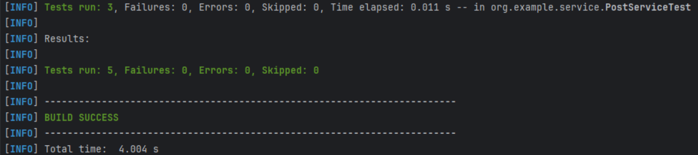
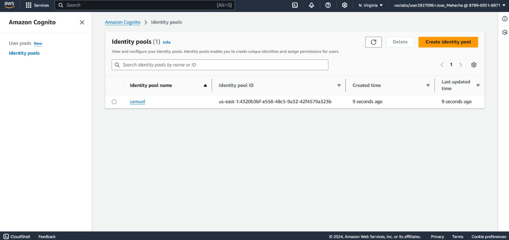
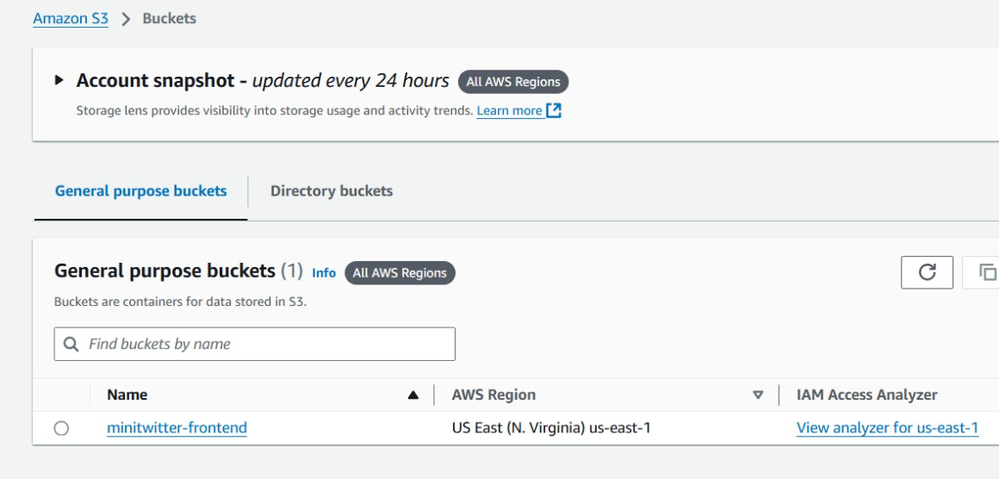
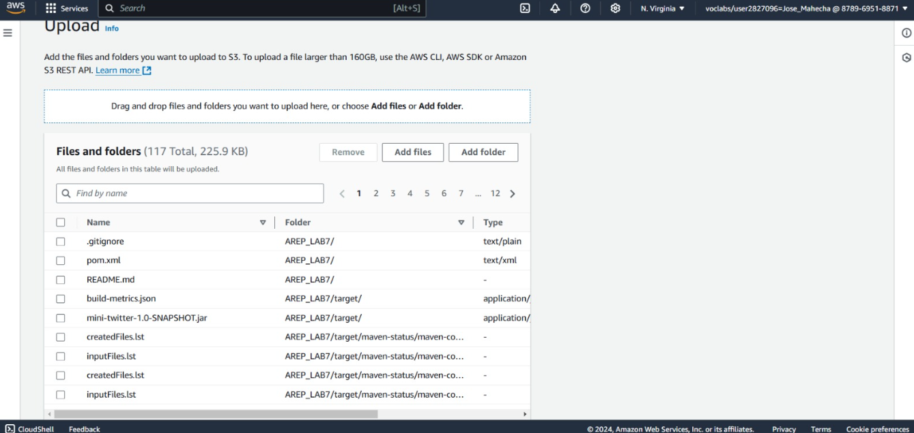
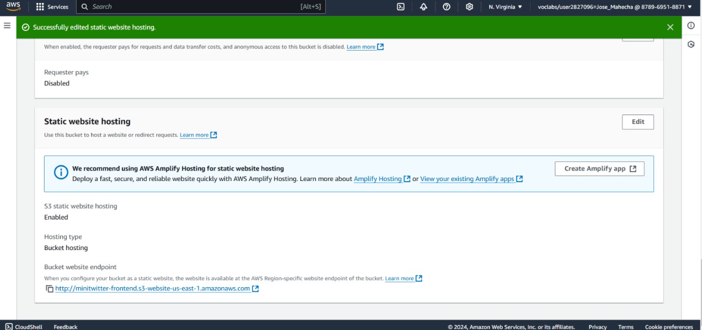
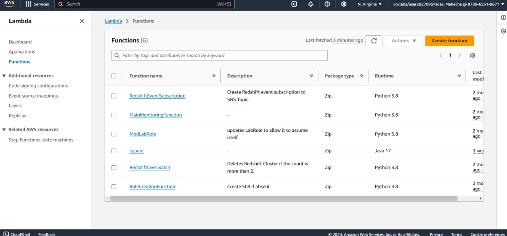
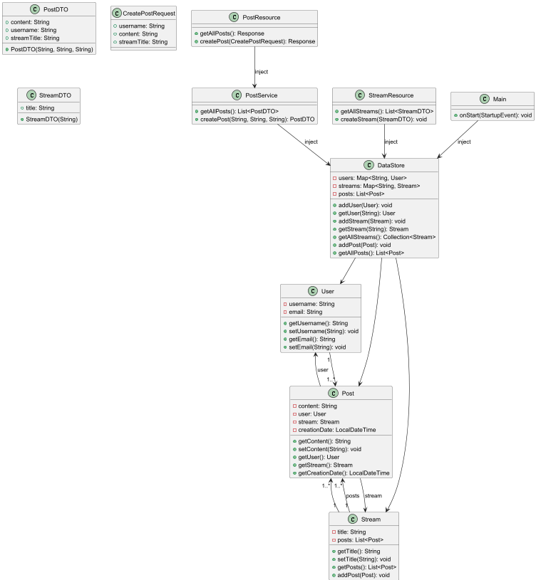
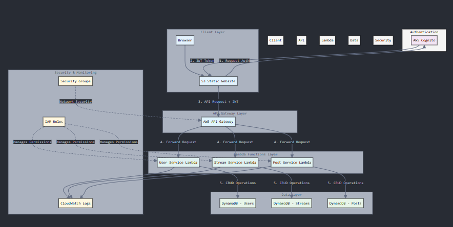

# Project Overview: Mini Twitter API with Quarkus
This project involves creating a "Mini Twitter" application, following a microservices architecture using Quarkus and AWS. The application allows users to post short messages (up to 140 characters), akin to a Twitter stream. The project includes designing an API, building a monolithic application with Quarkus, and later splitting it into microservices hosted on AWS Lambda.
## Explanation
The goal of this lab was to create a scalable, secure mini-Twitter application using Quarkus and AWS infrastructure. The application was designed to allow users to post short messages, with future capabilities for stream management and microservices. The lab included:
1. Design and Deploy an API with Quarkus:

* The API was developed in Quarkus, taking advantage of its lightweight, cloud-native capabilities to create a monolithic backend that manages:
* Users for handling basic user data.
* Streams to organize posts by categories.
* Posts limited to 140 characters to replicate Twitter’s simplicity.

* The API includes:
* POST /api/posts to create a new post.
* GET /api/posts to retrieve all posts.
* GET /api/streams and POST /api/streams to manage streams.
2. Build a Front-End JavaScript Application Deployed to Amazon S3:
* **JavaScript Client:** A minimal web interface allows users to interact with the backend API for creating and viewing posts.
* **AWS S3 Deployment:** The JavaScript application was hosted on S3, providing a simple and publicly accessible frontend for the service. This setup separates the client from the backend and uses S3’s reliable, scalable infrastructure.
3. Implement Secure Authentication Using AWS Cognito and JWTs:

* **AWS Cognito:** Integrated AWS Cognito for authentication, ensuring secure user access through JWTs. JWT tokens are issued upon login, which users must present to access certain API endpoints.
* **JWT Validation:** API endpoints validate the JWT to allow only authenticated users to create or retrieve posts, ensuring data access is restricted and secure.

4. Transition from Monolith to Microservices on AWS Lambda:

* **Service Separation:** The monolithic application was divided into three Lambda functions:
  - User Service for managing user accounts.
  - Stream Service for managing streams.
  - Post Service for handling post creation and retrieval.
* **AWS Lambda Deployment:**  Each service is deployed to Lambda, taking advantage of serverless architecture for scalability and cost efficiency. AWS Lambda automatically scales based on demand, which is ideal for handling intermittent traffic.
5. Documentation and Deliverables for Deployment and Testing:

* **GitHub Repository:** The project code was organized and uploaded to GitHub.
* **Architecture Report:** Documented the system architecture and infrastructure decisions.
* **Test Report:** Documented the testing strategies and results to confirm functionality and reliability.
* **Demo Video:** A video was created to demonstrate the application running, including deployment and security setup.

## Getting Started

These instructions will get you a copy of the project up and running on your local machine for development and testing purposes. See deployment for notes on how to deploy the project on a live system.

### Prerequisites

Before you begin, ensure that you have the following installed on your local machine:

* Java Development Kit (JDK): Ensure you have JDK 11 or higher installed. You can download it from the Oracle website or use an open-source alternative like AdoptOpenJDK.
```
java -version
```


* Maven: This project uses Maven for dependency management and building the application. Download it from the Maven website and follow the installation instructions.
```
mvn -version
```


* Git: You need Git to clone the repository. Download it from the Git website and install it.


to see the maven version we are using we need to enter the following command, also this is the version of Maven this programm uses

### Installing and Running the Application Locally

**Step 1: Clone the Repository**
* First, open a terminal and clone the GitHub repository to your local machine.
```
git clone https://github.com/JuanDavidGarciaPulido/AREP_LAB7.git
```

**Step 2: Navigate to the Project Directory**
* Change into the project directory:
```
cd AREP_LAB7
```

**Step 3: Install dependencies**
* Now that everything is configured, you need to install the project dependencies. You can do this using Maven.
* Run the following command in your project root folder:
```
mvn clean install

```
* This will download all the necessary dependencies and build the project.

**Step 5: Run the Quarkus application**
* After installing the dependencies, you can run the Quarkus application using the following Maven command:
```
mvn compile quarkus:dev 

```
* This will start the application on your local machine. You should see output in the console indicating that the application has started successfully.
* Once the application is running, open your web browser and go to:
- http://localhost:8080/login.html to access the application’s endpoints.

## Running the tests

To run the automated tests you'll have to type in the console
```
mvn test
```



### Break down into end-to-end tests

1. **PostResourceTest**

* This test class is for testing the PostResource class, which likely provides the REST API for handling posts. The tests focus on verifying the behavior of the resource endpoints, including handling successful and error scenarios.
2. **Test: GetAllPostsSuccess()**

* Purpose: This test verifies that when the getAllPosts() method of the PostResource is called, it correctly returns a successful response with status code 200 (OK). 
* Functionality: It uses the REST Assured library to send a GET request to the /api/posts endpoint and checks that the response status code is 200.
* Significance: This test ensures that the getAllPosts() method is working as expected and can retrieve all posts from the system.

3. **Test: CreatePostBadRequest()**

* Purpose: This test verifies that if the content of a post is empty, the API correctly returns a BAD_REQUEST (400) response with a corresponding error message.
* Functionality: It sends a POST request to the /api/posts endpoint with an empty post content and checks that the response status code is 400. 
* Significance: This test ensures that the API handles invalid requests appropriately and provides meaningful error messages to the client. 

4. **PostServiceTest**

* This test class is for testing the PostService class, which handles the business logic related to creating posts. The tests ensure that the service behaves correctly under various conditions.

5. **Test: CreatePostSuccess()**

* Purpose: This test verifies that when a valid post is created, the PostService correctly saves the post and returns the created post.
* Functionality: It creates a new post using the PostService and checks that the returned post matches the expected content.
* Significance: This test confirms that the PostService can successfully create posts and return the correct response to the client.

6. **Test: CreatePostUserNotFound()**

* Purpose: This test verifies that if an invalid username is provided (a user that doesn't exist), the createPost() method throws an IllegalArgumentException with the correct error message.
* Functionality: It attempts to create a post with a non-existent username and checks that the method throws an exception with the expected message.
* Significance: This test ensures that the PostService correctly handles cases where the user is not found and provides appropriate feedback to the client.

7. **Test:  CreatePostStreamNotFound()**

* Purpose: This test verifies that if an invalid stream is provided (a stream that doesn't exist), the createPost() method throws an IllegalArgumentException with the correct error message.
* Functionality: It attempts to create a post with a non-existent stream and checks that the method throws an exception with the expected message.
* Significance: This test ensures that the PostService correctly handles cases where the stream is not found and provides appropriate feedback to the client.

## Deployment

**To deploy the application on AWS, follow these steps:**

**Step 1: Setup Cognito for Authentication**
1. Create an Identity Pool:
* Go to the AWS Management Console and navigate to Cognito.
* Click on "Manage Identity Pools" and then "Create new identity pool."
* Enter a name for the identity pool and enable access to unauthenticated identities.
* Click "Create Pool" to create the identity pool.
* In application.properties, configure the authentication settings with Cognito pool details.
 ```
quarkus.oidc.auth-server-url=https://cognito-idp.<region>.amazonaws.com/<user_pool_id>
quarkus.oidc.client-id=<app_client_id>
quarkus.oidc.credentials.secret=<app
```
* Secure the endpoints in your Spring Boot application using the @RolesAllowed annotation to require authentication for accessing certain resources.



**Step 2: Deploy Frontend on S3**
1. Create an S3 Bucket:
* Go to the AWS Management Console and navigate to S3.
* Click on "Create bucket" and enter a unique bucket name.
* Upload the frontend files (HTML, CSS, JavaScript) to the S3 bucket.
* Make the bucket public and enable static website hosting.
* Copy the bucket URL to access the frontend application.







**Step 3: Setup Backend Microservices in AWS Lambda**
1. Create AWS Lambda Functions:
* Go to the AWS Management Console and navigate to Lambda.
* Click on "Create function" and choose the runtime for your function (e.g., Java 11).
* Upload the JAR file containing your Lambda function code.
* Configure the function settings, including memory, timeout, and environment variables.
* Repeat the process for each microservice (User, Stream, Post).

2. Configure API Gateway:
* Create a new API in API Gateway and configure the endpoints to trigger the Lambda functions.
* Set up the API Gateway to handle requests from the frontend and route them to the appropriate Lambda function.
* Secure the API Gateway using AWS Cognito for authentication and authorization.
* Test the API endpoints using Postman or a similar tool to ensure they are working correctly.

3. Deploy API Gateway:
* Deploy the API Gateway to make the endpoints accessible to the frontend application.
* Use the API Gateway URL to access the backend services from the frontend.



**Step 6: Testing the Full Deployment**
1. Test the Frontend:
* Visit the S3 URL or the custom domain pointing to your frontend.
* Ensure the frontend loads properly and is interactive.

2. Test the API (Backend):
* Send requests to the API Gateway endpoints using Postman or a similar tool.
* Verify that the API endpoints return the expected responses.
   
3. Verify JWT Authentication:
* Test that the authentication token from Cognito is being sent correctly from the frontend to the backend.
* Ensure that the backend validates the JWT token and allows access to authorized endpoints.


### Acceptance test in AWS

https://github.com/user-attachments/assets/e2f8dfc3-468d-4533-a9c7-e74a33b511c5

### Key Features
1. **JWT-Based Authentication:**
*Users authenticate with JSON Web Tokens (JWT) managed via AWS Cognito, ensuring secure access to the application. JWT allows stateless, verifiable user authentication, making it ideal for modern web applications where the client and server interact over multiple sessions without re-authenticating.

2. **Microservices Architecture:**
* The application is broken down into three separate microservices, deployed on AWS Lambda. Each microservice is responsible for different aspects of the application (post management, stream updates, and user interactions), enabling efficient scaling and independent development.

3. **Serverless Functions with AWS Lambda:**
* Microservices deployed as AWS Lambda functions allow automatic scaling based on demand, optimizing costs and performance. The functions are triggered by specific API endpoints, managed by AWS API Gateway, providing a highly responsive and flexible backend.

4. **Cross-Origin Resource Sharing (CORS) for API:**
* Configured CORS allows only requests from the frontend deployed on Amazon S3 to access the backend. This ensures API security by restricting requests to verified origins, preventing potential CSRF attacks.

5. **Frontend SPA Deployed on S3:**
* A single-page application (SPA) built with JavaScript and HTML5 provides a smooth, interactive user experience. Hosted on Amazon S3, the frontend is served reliably and scales automatically with incoming traffic, enhancing performance and user satisfaction.

6. **Quarkus Framework for Backend Services:**
* Using Quarkus enables rapid and efficient development of the backend in Java, with fast startup times suitable for cloud environments. Quarkus' lightweight framework is optimized for running on Kubernetes and serverless environments like AWS Lambda.

7. **AWS Infrastructure and Secure Networking:**
* Deployed across multiple AWS services, including EC2, Lambda, and S3, with security groups configured to restrict access based on roles. Only specific ports and protocols are open for communication, protecting the application from unauthorized access.


### Diagram Class



## Class Diagram Breakdown

### 1. Package: `org.example`
El diagrama organiza todas las clases bajo el paquete `org.example` para mantener la estructura y mejorar la organización del código.

### 2. Class: `User`
**Attributes:**
- **`username: String`**: Almacena el nombre de usuario.
- **`email: String`**: Almacena el correo electrónico del usuario.

**Methods:**
- **`getUsername(): String`**: Devuelve el nombre de usuario.
- **`setUsername(String): void`**: Establece el nombre de usuario.
- **`getEmail(): String`**: Devuelve el correo electrónico del usuario.
- **`setEmail(String): void`**: Establece el correo electrónico del usuario.

**Relationships:**
- `User` tiene una relación de uno a muchos con `Post`, ya que cada usuario puede crear múltiples posts.

### 3. Class: `Stream`
**Attributes:**
- **`title: String`**: El título del stream.
- **`posts: List<Post>`**: Lista de posts en este stream.

**Methods:**
- **`getTitle(): String`**: Devuelve el título del stream.
- **`setTitle(String): void`**: Establece el título del stream.
- **`getPosts(): List<Post>`**: Devuelve todos los posts dentro del stream.
- **`addPost(Post): void`**: Agrega un post al stream.

**Relationships:**
- Cada `Stream` tiene múltiples posts, estableciendo una relación de uno a muchos con la clase `Post`.

### 4. Class: `Post`
**Attributes:**
- **`content: String`**: Contenido del post.
- **`user: User`**: Referencia al usuario que creó el post.
- **`stream: Stream`**: Referencia al stream al que pertenece el post.
- **`creationDate: LocalDateTime`**: Fecha y hora de creación del post.

**Methods:**
- **`getContent(): String`**: Devuelve el contenido del post.
- **`setContent(String): void`**: Establece el contenido del post.
- **`getUser(): User`**: Obtiene el usuario que creó el post.
- **`getStream(): Stream`**: Obtiene el stream del post.
- **`getCreationDate(): LocalDateTime`**: Obtiene la fecha de creación del post.

**Relationships:**
- `Post` tiene referencias a `User` y `Stream`, estableciendo relaciones con ambas clases.

### 5. Class: `PostDTO`
**Attributes:**
- **`content: String`**: Contenido del post.
- **`username: String`**: Nombre de usuario del creador del post.
- **`streamTitle: String`**: Título del stream al que pertenece el post.

**Constructor:**
- **`PostDTO(String, String, String)`**: Crea una instancia de `PostDTO` usando el contenido, nombre de usuario y título del stream.

### 6. Class: `CreatePostRequest`
**Attributes:**
- **`username: String`**: Nombre de usuario del creador del post.
- **`content: String`**: Contenido del post.
- **`streamTitle: String`**: Título del stream al que se añadirá el post.

**Purpose:**
- Encapsula los datos para crear un nuevo post, típicamente usado como objeto de solicitud.

### 7. Class: `StreamDTO`
**Attributes:**
- **`title: String`**: Título del stream.

**Constructor:**
- **`StreamDTO(String)`**: Crea una instancia de `StreamDTO` con el título del stream.

### 8. Class: `DataStore`
**Attributes:**
- **`users: Map<String, User>`**: Mapea nombres de usuario a objetos `User`.
- **`streams: Map<String, Stream>`**: Mapea títulos de stream a objetos `Stream`.
- **`posts: List<Post>`**: Almacena todos los posts en la aplicación.

**Methods:**
- **`addUser(User): void`**: Agrega un usuario al almacén de datos.
- **`getUser(String): User`**: Obtiene un usuario por nombre de usuario.
- **`addStream(Stream): void`**: Agrega un stream al almacén de datos.
- **`getStream(String): Stream`**: Obtiene un stream por título.
- **`getAllStreams(): Collection<Stream>`**: Devuelve todos los streams.
- **`addPost(Post): void`**: Agrega un post al almacén de datos.
- **`getAllPosts(): List<Post>`**: Devuelve todos los posts.

**Relationships:**
- Gestiona instancias de `User`, `Stream` y `Post`.

### 9. Class: `PostService`
**Methods:**
- **`getAllPosts(): List<PostDTO>`**: Devuelve una lista de todos los posts como objetos `PostDTO`.
- **`createPost(String, String, String): PostDTO`**: Crea un nuevo post y devuelve un `PostDTO`.

**Relationships:**
- Interactúa con `DataStore` para recuperar y gestionar datos de posts.

### 10. Class: `PostResource`
**Methods:**
- **`getAllPosts(): Response`**: Recupera todos los posts como respuesta de la API.
- **`createPost(CreatePostRequest): Response`**: Crea un nuevo post basado en `CreatePostRequest`.

**Relationships:**
- Utiliza `PostService` para manejar solicitudes relacionadas con los posts.

### 11. Class: `StreamResource`
**Methods:**
- **`getAllStreams(): List<StreamDTO>`**: Recupera todos los streams como objetos `StreamDTO`.
- **`createStream(StreamDTO): void`**: Agrega un nuevo stream.

**Relationships:**
- Utiliza `DataStore` para gestionar y responder con datos de los streams.

### 12. Class: `Main`
**Methods:**
- **`onStart(StartupEvent): void`**: Ejecuta tareas cuando la aplicación inicia.

**Relationships:**
- Inyecta dependencias en `DataStore`, enlazándolo con otros componentes de la aplicación.

### Overall Structure and Flow
El diagrama representa una aplicación de redes sociales en miniatura que permite a los usuarios crear posts dentro de streams específicos. Las áreas clave incluyen:

1. **Gestión de Usuarios**: Administrada a través de las clases `User` y `DataStore`.
2. **Gestión de Posts**: Las clases `Post` y `PostService` manejan la creación y recuperación de posts.
3. **Capa API**: Las clases `PostResource` y `StreamResource` definen los endpoints de la API.
4. **Aplicación Principal**: `Main` inicia la aplicación, organizando las inyecciones de dependencias.


## Architecture



## Architecture Overview

The architecture is designed using AWS serverless components, which allows scalability, security, and high availability. Each component plays a crucial role in ensuring that the application runs efficiently and securely.

### 1. Frontend Layer

**S3 Static Website**
- **Role**: Hosts the Single-Page Application (SPA).
- **Responsibilities**:
  - Provides the user interface for posting and viewing tweets.
  - Communicates with the backend via REST API through the API Gateway.
  - Hosts static files (HTML, CSS, JavaScript) for the user to interact with the application.

### 2. Authentication Layer

**AWS Cognito**
- **Role**: Manages user authentication.
- **Responsibilities**:
  - Handles user registration and login processes.
  - Issues JWT tokens for authentication and authorization.
  - Integrates with Quarkus security, allowing seamless user authentication in the application.
  - Manages user sessions, enforcing access controls based on JWT tokens.

### 3. API Gateway Layer

**AWS API Gateway**
- **Role**: Routes requests to the appropriate backend services.
- **Responsibilities**:
  - Routes REST API requests to the relevant Lambda functions.
  - Handles API versioning to manage different versions of the API over time.
  - Provides automatic API documentation to ease integration and usage for developers.
  - Manages rate limiting to prevent abuse and ensure fair usage of resources.

### 4. Microservices Layer (Lambda Functions)

**User Service**
- **Responsibilities**:
  - Manages user profiles and their updates.
  - Validates authentication tokens received from AWS Cognito.
  - Uses the `User` domain model to interact with the data and enforce business rules.

**Stream Service**
- **Responsibilities**:
  - Manages stream creation and categorization.
  - Lists available streams to the users.
  - Uses the `Stream` domain model to structure and organize the data.

**Post Service**
- **Responsibilities**:
  - Handles the creation and retrieval of posts (tweets).
  - Validates post content to ensure it adheres to business rules (e.g., character length limit).
  - Uses the `Post` domain model for managing post-related data.

These Lambda functions are isolated for scalability and fault tolerance, enabling independent deployment and maintenance.

### 5. Data Layer

**DynamoDB Tables**
- **Role**: Store data in a highly scalable, low-latency manner.
- **Responsibilities**:
  - **Users Table**: Stores user data, including usernames and profile information.
  - **Streams Table**: Stores information related to streams, including titles and categories.
  - **Posts Table**: Stores the content of user posts (tweets), linked to users and streams.
- **Optimization**: DynamoDB is optimized for fast reads and writes, with automatic scaling to handle varying loads.

### 6. Security & Monitoring

**IAM Roles & Policies**
- **Role**: Manage permissions for accessing AWS resources securely.
- **Responsibilities**:
  - Define Lambda execution roles with necessary permissions to access other AWS services (e.g., DynamoDB).
  - Create S3 bucket policies to control access to static files.
  - Define API Gateway permissions to control who can access the API endpoints.

**CloudWatch**
- **Role**: Monitor and log application performance and health.
- **Responsibilities**:
  - Logs application activity and errors.
  - Tracks performance metrics like response times, errors, and throughput.
  - Triggers alarms for performance degradation or operational issues.

**Security Groups**
- **Role**: Control network access to resources.
- **Responsibilities**:
  - Define security groups to manage inbound and outbound traffic for Lambda functions, API Gateway, and other AWS services.
  - Ensure proper isolation of services to prevent unauthorized access.

### 7. Key Integration Points

**Frontend to Backend**
- **REST API Calls**: The frontend communicates with the backend services using RESTful API endpoints exposed by the API Gateway.
- **JWT Authentication**: The frontend includes the JWT token in API requests to authenticate users.
- **CORS Configuration**: Ensures the frontend (hosted on S3) can securely interact with the backend API across different domains.

**Inter-service Communication**
- **Event-driven Architecture**: Services communicate asynchronously via events or API calls, ensuring decoupling of components.
- **Asynchronous Processing**: Tasks such as post creation or stream management are handled asynchronously to improve system responsiveness.
- **Service Discovery**: AWS services like API Gateway facilitate dynamic communication between services without needing hardcoded endpoints.

**Data Flow**
- **Request Validation**: All incoming requests undergo validation to ensure that they contain valid data before processing.
- **Data Transformation**: Data from the frontend is transformed to match the backend model, and responses are formatted for the frontend to consume.
- **Response Formatting**: After processing, responses are sent back in a user-friendly format (usually JSON) for the frontend to render.

### 8. Benefits of the Architecture

- **Scalability**: The architecture is serverless, with AWS Lambda and other managed services scaling automatically based on demand.
- **Security**: Multiple layers of security, including AWS Cognito for authentication and IAM roles for resource access, ensure secure operations.
- **High Availability**: AWS services are designed for high availability, ensuring that the application remains operational even in the event of infrastructure failures.
- **Cost Optimization**: The pay-per-use model of serverless components (like AWS Lambda and DynamoDB) optimizes costs based on actual usage.
- **Easy Maintenance**: With microservices isolated into independent Lambda functions, the system is easy to update and maintain with minimal impact on other components.

## Generating javadoc

Simply enter the following commands

```
mvn javadoc:javadoc
```

```
mvn javadoc:jar
```

```
mvn javadoc:aggregate
```

```
mvn javadoc:aggregate-jar
```

```
mvn javadoc:test-javadoc 
```

## Built With

* [Maven](https://maven.apache.org/) - Dependency Management
* [Java](https://www.oracle.com/java/technologies/) - Programming Language
* [HTML 5](https://html.spec.whatwg.org/multipage/) - HiperText Markup Lenguaje
* [Quarkus](https://www.mysql.com/)- Framework

## Versioning

Github.

## Authors

* **Jose Samuel Mahecha Alarcon** -  https://github.com/samuelmahecha.
* **Juan David Garcia Pulido**  - https://github.com/JuanDavidGarciaPulido
* **Hann Jang** - https://github.com/Hajaku12
